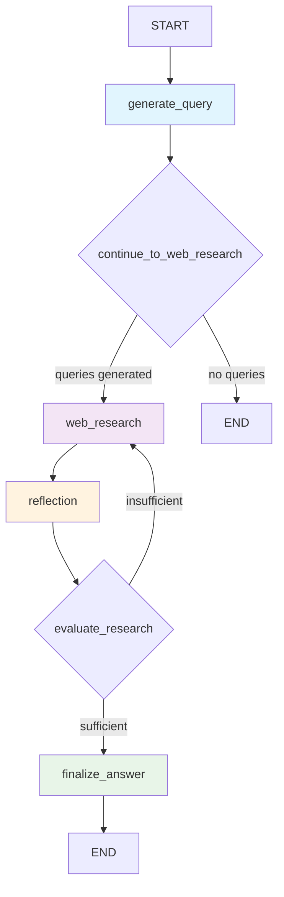

# Deep Researcher Agent

A sophisticated research agent built with LangGraph that performs automated web research with iterative refinement and structured output.

## 🏗️ Architecture

The DeepResearcher agent uses a LangGraph-based workflow with four main nodes that work together to perform comprehensive research:



### Node Descriptions

1. **`generate_query`** - Analyzes the research topic and generates structured search queries using LLM with instructor for structured output
2. **`web_research`** - Performs web searches using Google AI Search API and processes results
3. **`reflection`** - Evaluates research completeness and identifies knowledge gaps
4. **`finalize_answer`** - Synthesizes all research into a comprehensive, well-structured answer

### State Management

The agent uses a sophisticated state management system with the following key state types:

- **`ResearchState`** - Main workflow state containing messages, search queries, results, and metadata
- **`QueryState`** - State for query generation with rationale
- **`WebSearchState`** - State for web search operations
- **`ReflectionState`** - State for reflection and evaluation
- **`ResearchOutput`** - Final structured output with content, sources, and summary

## 🚀 Quick Start

### Prerequisites

1. Python 3.11+
2. Required API keys:
   - `OPENROUTER_API_KEY` - For LLM functionality
   - `GEMINI_API_KEY` - For web search capabilities

### Installation

```bash
# Clone the repository
git clone <repository-url>
cd multi-agents-talk/code

# Install dependencies
poetry install

# Set up environment variables
cp env.example .env
# Edit .env with your API keys
```

### Running the Example

```bash
cd code
poetry run python examples/deep_researcher_example.py
```

## 📋 Configuration

The agent can be configured using the `Configuration` class:

```python
from agentdemo.agents.deep_researcher import Configuration, DeepResearcher

config = Configuration(
    number_of_initial_queries=3,
    max_research_loops=3,
    search_engine="google",  # or "tavily"
    query_generator_model="google/gemini-2.5-flash",
    answer_model="google/gemini-2.5-pro"
)

researcher = DeepResearcher(configuration=config)
```

### Configuration Options

| Option | Default | Description |
|--------|---------|-------------|
| `number_of_initial_queries` | 2 | Number of initial search queries to generate |
| `max_research_loops` | 2 | Maximum number of research iterations |
| `search_engine` | "tavily" | Search engine to use ("google" or "tavily") |
| `query_generator_model` | "google/gemini-2.5-flash" | Model for query generation |
| `web_search_model` | "google/gemini-2.5-flash" | Model for web search processing |
| `reflection_model` | "google/gemini-2.5-flash" | Model for reflection and evaluation |
| `answer_model` | "google/gemini-2.5-pro" | Model for final answer generation |

## 🔧 Advanced Usage

### Custom Research Topics

```python
# Simple research
result = researcher.research("What are the latest developments in quantum computing?")

# Research with context
context = {
    "user_preferences": "Focus on commercial applications",
    "depth": "comprehensive"
}
result = researcher.research(
    user_message="How does AI impact healthcare?",
    context=context
)
```

## 🔍 Research Workflow

1. **Query Generation**: The agent analyzes the research topic and generates structured search queries
2. **Web Research**: Performs web searches and processes results using Google AI Search API
3. **Reflection**: Evaluates research completeness and identifies knowledge gaps
4. **Iteration**: If gaps exist, generates follow-up queries and repeats research
5. **Synthesis**: Combines all findings into a comprehensive, well-structured answer

## 🛠️ Development

### Project Structure

```
code/
├── agentdemo/
│   ├── agents/
│   │   └── deep_researcher/
│   │       ├── configuration.py    # Configuration management
│   │       ├── prompts.py         # Research prompts
│   │       ├── researcher.py      # Main agent implementation
│   │       ├── schemas.py         # Pydantic schemas
│   │       └── state.py           # State definitions
│   └── common/
│       ├── llm/                   # LLM integration
│       ├── logging_config.py      # Logging configuration
│       └── websearch/             # Web search integration
├── examples/
│   └── deep_researcher_example.py # Usage example
└── pyproject.toml                 # Project configuration
```

## 🙏 Acknowledgments

- Built with [LangGraph](https://github.com/langchain-ai/langgraph) for workflow orchestration
- Uses [Instructor](https://github.com/jxnl/instructor) for structured LLM output
- Powered by [Google AI Search](https://ai.google.dev/) for web research
- LLM integration via [OpenRouter](https://openrouter.ai/) 